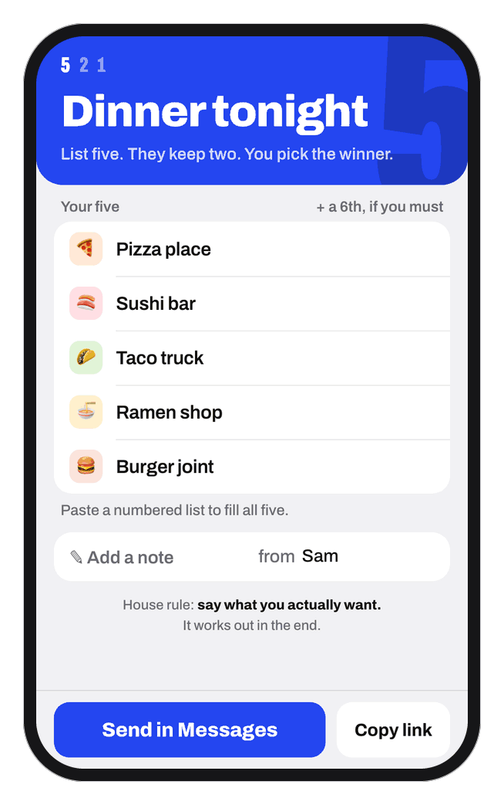
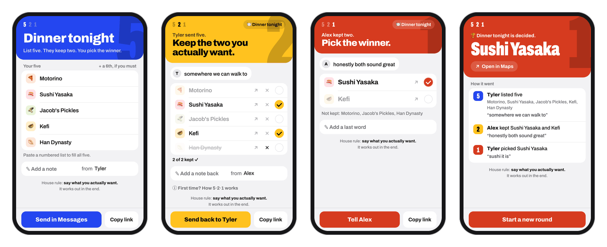

<p align="center">
  <picture>
    <source media="(prefers-color-scheme: dark)" srcset="docs/round-night.gif">
    
  </picture>
</p>

<h1 align="center">5 · 2 · 1</h1>

<p align="center">
  <b>List 5. Keep 2. Pick 1.</b><br>
  A two-person decision ritual you play over text.<br>
  <a href="https://tylerwhughes.com/521/"><b>tylerwhughes.com/521</b></a>
</p>

---

"Where should we eat?" can go in circles. 5·2·1 ends it in three texts:

1. **You list five.** Five options you'd be glad to go with.
2. **They keep two.** The two they actually want. The other three are gone.
3. **You pick one.** From their two. Done, and you both had a real say.

Each step has its own color, so one glance tells you whose turn it is:
**blue** while you list, **yellow** while they keep, **red** when you pick.

<picture>
  <source media="(prefers-color-scheme: dark)" srcset="docs/screens-night.png">
  
</picture>

## The link is the game

There is no server. The whole round (the title, the names, the five options, the two
keeps, the winner, and any notes) is packed into the link itself:

```
round → JSON → deflate → base64url → everything after the #
```

A round fits in about 200 characters, well under the length where iMessage starts
cutting links apart. So the text thread *is* the game board:

```
You    https://tylerwhughes.com/521/#2FY2xCgIxEER_JWxjk8b2…              list 5
Them   https://tylerwhughes.com/521/#2DY2xCgIxEER_JWxjk-aw…              keep 2
You    🏆 Sushi Yasaka! https://tylerwhughes.com/521/#2DU49CwIxDP0r…     pick 1
```

- **Nothing is stored anywhere.** Browsers never send the part after `#` to a server,
  so a round never lands in a log. No accounts, no cookies, no analytics.
- **Sending takes one tap.** The next link is built while you type, so
  **Send in Messages** opens Messages with it already filled in.
- **Old links keep working.** Links from before compression still open.

**Try it:** [this link](https://tylerwhughes.com/521/#2FY2xCgIxEER_JWxjk8b26itEEQRt5LBYw2pC4i5kc4Yg_rtrNTNvYOYDb5i2HhQmCGsDD83cnJipuiacnvEPi8HLKFTNC0wLHKVJTSyWz6vG5K6omNHiHoPcN-pOKeRCauRAj2SyQ3bzYNQ24OaBbVLlRT1SJdfJBes7lmy38P0B)
is a real round. You're the one keeping two.

## Small things

- Every option gets an emoji, guessed by 122 rules (sushi 🍣, tacos 🌮, "Five Guys" 🍔)
  and a hand-picked list of about 90 local spots. Tap it to choose your own.
- Paste a numbered list into any row and it fills all five.
- Tap ✕ to cross an option out while you think. That stays on your phone.
- Each handoff can carry a short note: "somewhere we can walk to".
- You can change your pick right up until you send it.
- At night the colored band dims and the big number glows.
- A sixth option is allowed. It's cheating, but fine.

## House rule

**Say what you actually want.** No strategy, no guessing what they'd prefer.
It works out in the end.

## Run it

```sh
./run.sh     # serves http://localhost:8521
./test.sh    # headless Chrome plays a whole round: 60 checks
```

One `index.html`: no build step, no framework, no dependencies to install.
Vendored: the [Archivo](https://github.com/Omnibus-Type/Archivo) typeface (SIL OFL 1.1)
and [Leaflet](https://leafletjs.com) (BSD-2) for a map view that is switched off for now.
Hosted on GitHub Pages; any static host works.
